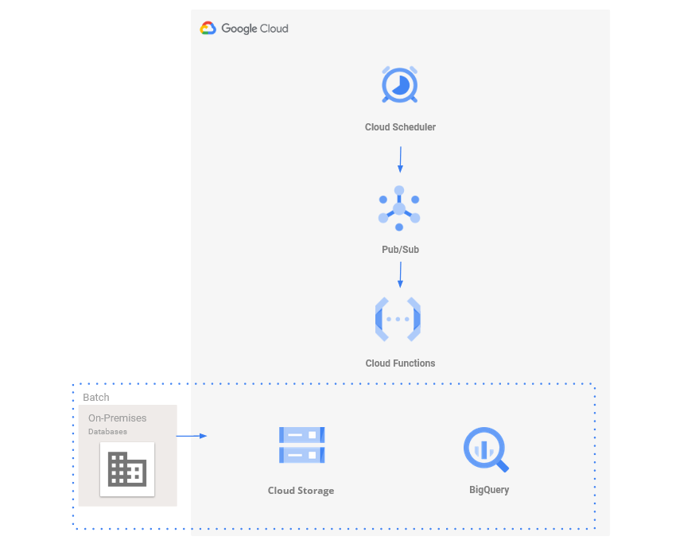

# FTP files extraction automated with GCP tools
### Moving your .csv files to Cloud Storage and BigQuery

Cloud Fucntions is an event-driven serverless cloud tool that makes easy to develop a small extraction&load from a FTP server to our data wharehouse (Bigquery).Although this simple extract & load task, I included a small transformation that happens in between as we need to "build" the csv file for both store it on Storage and then upload to BigQuery. It's a company requirement to store the csv file in a bucket too.

As we want this process to be triggered daily, we use Cloud Schedule (cron jobs) to send everyday at the same time, a pub/sub message that launch our code. As you can see on the .py file, we use an out-of-the-box library for the FTP connection and then the Google Cloud API to develop the whole process.