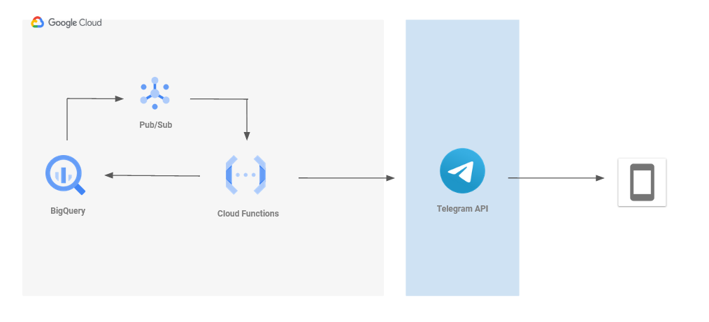

# Telegram alert


So, we have a table in BigQuery that it's updated every day first in the morning. And we have a request from a VIP at the company that wants a particular KPI calculated on his mobile phone as soon as the data is updated in that table. The following approach is to build a pipeline flow where we trigger a function that query our table and post the results on a Telegram channel using a bot.

First, we create a sink with the log information corresponding to the update job, you can use this snippet as a template:
```
protoPayload.serviceData.jobCompletedEvent.job.jobConfiguration.load.destinationTable.datasetId="my_dataset_id"
protoPayload.serviceData.jobCompletedEvent.job.jobConfiguration.load.destinationTable.projectId="my_project_id"
protoPayload.authenticationInfo.principalEmail="my-service-account@my_project.iam.gserviceaccount.com"
protoPayload.methodName="jobservice.jobcompleted"
protoPayload.serviceData.jobCompletedEvent.job.jobConfiguration.load.destinationTable.tableId:"my_table"
```
Adjust the timeframe to your last-known update and you should be able to see the messages gathered by Cloud Logs. Now is when the Pub/Sub service comes into action. Pub/Sub stands for Publish–Subscribe and we can say that is how the system communicates with other systems. Now, we create a new topic that collects the logs we have identified in our sink.  This way, we will be able to recover this message every time our table is updated.

And here comes the Cloud Function functionality. You can upload small snippets of code (functions) to this service to be run every time we set it up. On this case, we will make our Pub/Sub service as the trigger, meaning that, we run the function every time our table is updated.

As you can see in the code, once we collect the data we want to send to our channel, we insert the variables in our message and send it all using the Telegram API. And, there you go, you have your your data on a daily basis on your phone 🙂

### Recommendations

Using Google Cloud Functions: 
- Python 3.8
- Remember to include the function you want to call as Entry Point